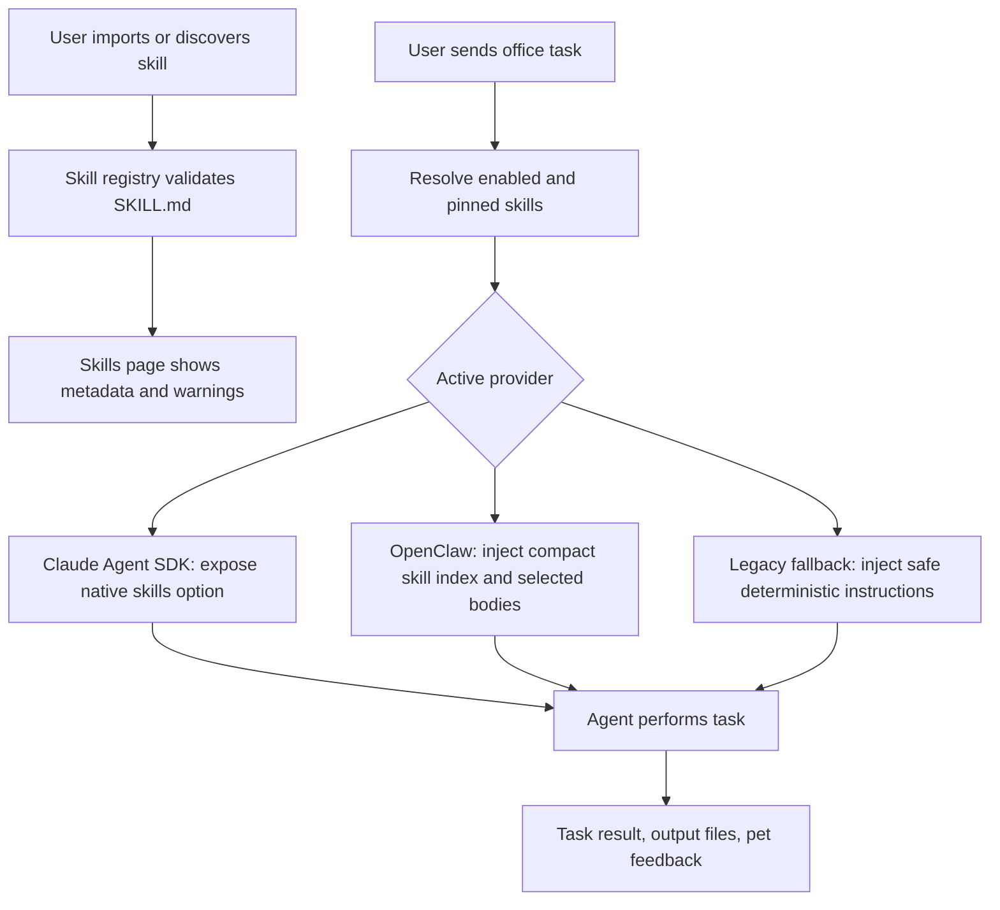

# HaJiMi Skills Management Design

## Goal

Add Skills management to HaJiMi so users can import, enable, inspect, and apply reusable office capability packages.

The feature should feel like Claude Code Skills, not like another prompt preset page. A skill is a model-callable capability package centered on `SKILL.md`, with optional supporting files. HaJiMi manages the skills, while the active office backend consumes them:

- advanced office: prefer Claude Code / Claude Agent SDK native Skills discovery and invocation;
- ordinary office: expose the same skills as OpenClaw-readable task context, with the legacy agent using them only as fallback instructions.

Users should not need to understand backend routing. They should see one Skills area and one office composer.

## Current Context

HaJiMi already has:

- a single office-first conversation flow;
- model profiles for ordinary and advanced office;
- ordinary office through OpenClaw with a hand-written fallback;
- advanced office through Claude Agent SDK / Claude Code;
- per-project memory and execution target selection;
- capability checks and task progress feedback.

Skills should attach to this existing flow. They must not reintroduce a separate "chat mode" or a large plugin dashboard.

## Source Alignment

The implementation should follow Claude Code's Skills model:

- skills are directories containing a required `SKILL.md`;
- the frontmatter description helps the model decide when to invoke a skill;
- skill body content is loaded when the skill is used, so long references do not need to be injected into every request;
- Claude Agent SDK discovers filesystem skills and supports controlling available skills through its `skills` option;
- project skills live under `.claude/skills/<skill-name>/SKILL.md`, while personal skills live under the user skills directory.

References checked on 2026-05-17:

- [Claude Code Skills](https://code.claude.com/docs/en/skills)
- [Claude Agent SDK Skills](https://code.claude.com/docs/en/agent-sdk/skills)

## Non-Goals

- No public skill marketplace in the first version.
- No remote skill auto-install.
- No arbitrary executable scripts running during import.
- No always-on background skill scanner beyond lightweight file metadata reads.
- No per-message noisy banner saying which skill or backend was used.
- No full plugin permission system in the first version.

## User Experience

### Skills Page

Add a side navigation entry: `技能`.

The page has a Codex-like quiet layout:

- left list: installed skills;
- right detail: metadata, source path, enable state, scope, description, and `SKILL.md` preview;
- top-right compact actions: import skill, open folder, refresh.

Each skill row shows:

- name;
- short description;
- enabled or disabled state;
- scope badge: global, project, or built-in/imported.

The detail panel supports:

- enable or disable;
- set scope: all projects or current project;
- copy skill path;
- open skill folder;
- remove imported skill;
- view validation warnings.

Built-in or discovered Claude Code skills are read-only unless they were imported into HaJiMi storage.

### Import Flow

First version supports importing a local folder.

Rules:

1. The folder must contain `SKILL.md`.
2. HaJiMi reads frontmatter and markdown body.
3. HaJiMi copies the folder into its managed skills directory under app user data.
4. HaJiMi stores only registry metadata in settings or a small separate `skills-registry.json`.
5. Scripts and supporting files are copied but not executed during import.

If import validation fails, show a direct error:

```text
没有找到 SKILL.md。
请选择包含 SKILL.md 的技能文件夹。
```

### Office Composer

Keep the composer light.

Add one compact skills control near the existing model/target controls:

```text
技能  自动
```

States:

- `自动`: HaJiMi lets the backend/model choose from enabled skills.
- selected count: e.g. `技能 2`.
- disabled: `技能 关`.

Clicking opens a small popover:

- Auto use enabled skills;
- Disable skills for this task;
- Pin specific skills for this task.

Do not add a large inline checklist to the main office page.

## Skill Model

### Registry

Create a focused registry model:

```ts
type SkillScope = "global" | "project";

type SkillSource = "managed" | "project" | "user-claude" | "bundled";

type ManagedSkill = {
  id: string;
  name: string;
  description: string;
  path: string;
  source: SkillSource;
  enabled: boolean;
  scope: SkillScope;
  projectPath?: string;
  importedAt: string;
  updatedAt: string;
  warnings: string[];
};
```

Use `name` from frontmatter when present. Otherwise use the folder name.

### Storage

Use a separate store:

```text
%APPDATA%/xiaomi-pet-windows/skills/
  registry.json
  managed/
    <skill-id>/
      SKILL.md
      ...
```

Keep skills out of main settings to avoid bloating settings and to reduce churn.

Project-scoped skills may also be materialized into:

```text
<project>/.claude/skills/<skill-name>/SKILL.md
```

Only do this when the user explicitly chooses project scope or advanced office needs native project discovery.

## Execution Design

### Advanced Office: Claude Agent SDK

When the active model provider is `claude-agent`, HaJiMi should prefer native Skills.

Flow:

1. Resolve enabled skills for the current project.
2. Ensure managed skills are available to Claude Code discovery, either by:
   - copying/linking selected managed skills into a HaJiMi-controlled `.claude/skills` directory for the session, or
   - using SDK plugin/setting source support if it fits the existing SDK wrapper cleanly.
3. Pass the enabled skill names through the SDK `skills` option:
   - `"all"` when auto mode should expose every resolved skill;
   - `[]` when disabled for this task;
   - a string list when the user pins specific skills.
4. Let Claude invoke relevant skills naturally.

This is the closest match to Claude Code behavior. HaJiMi should not manually paste every skill into the prompt for advanced office.

### Ordinary Office: OpenClaw

OpenClaw may not consume Claude Skills natively in the same way. For ordinary office, HaJiMi should provide a compatibility layer.

Flow:

1. Resolve enabled skills for the current task.
2. Build a compact skill index from `name` and `description`.
3. Include that index in the OpenClaw agent system prompt.
4. If task text directly invokes `/skill-name` or matches a high-confidence description, include the first section of that skill's `SKILL.md` body.
5. Avoid injecting every skill body on every request.

This keeps ordinary office useful without making prompts huge.

### Legacy Agent Fallback

The hand-written fallback gets only deterministic skill instructions:

- skill names and descriptions;
- explicitly pinned skill body;
- no dynamic command injection.

If the fallback cannot honor a skill's script or external-tool expectation, it should answer with a clear limitation instead of pretending.

## Model-Callable Behavior

Skills are model-callable in two ways:

1. **Native Claude route**: Claude Agent SDK exposes Skills as Claude's own Skill tool. The model decides when to call them.
2. **Compatibility route**: ordinary office receives available skill metadata and can ask HaJiMi to load a skill through a small internal `use_skill` mechanism.

First version compatibility behavior:

- `use_skill` is internal to the agent layer, not a visible user button.
- A request may load at most three skill bodies unless the user directly invokes a skill.
- Skill content is cached for the current office task.
- Skill loading is reflected only in debug logs or a subtle task detail, not as a new chat message.

Direct user invocation should work:

```text
/excel-summary 帮我分析这个表格
```

When a skill is directly invoked, HaJiMi pins that skill for the current task.

## Permission And Safety

Skills can contain instructions that influence agent behavior, so they must be treated as trusted local packages.

Import safety:

- read and copy files;
- do not execute scripts;
- show warning if `SKILL.md` mentions broad shell execution, credential access, network exfiltration, or destructive file operations;
- show the source path and require enablement after import.

Execution safety:

- the existing office permission mode remains authoritative;
- a skill cannot grant more permission than the current office permission mode;
- `allowed-tools` or similar Claude fields are displayed as warnings in HaJiMi, but first version does not automatically widen HaJiMi permissions because of them;
- remote bridge target permissions still govern remote execution.

## UI Details

The Skills page should stay visually close to current Codex-like HaJiMi pages:

- white background;
- left list and right detail;
- compact controls;
- no big cards inside cards;
- no marketplace-style hero area.

Validation warnings use quiet inline rows, not modals.

Example detail layout:

```text
技能

[列表]                         [详情]
Excel 表格处理                  名称: Excel 表格处理
PDF 阅读                        范围: 当前项目
公众号写作                      状态: 已启用

                               描述
                               ...

                               SKILL.md
                               ...
```

## Data Flow



## Error Handling

- Missing `SKILL.md`: block import.
- Invalid frontmatter: import with warning if markdown body is readable.
- Duplicate name: keep both internally but require a unique display suffix, e.g. `excel` and `excel 2`.
- Skill folder deleted externally: mark as missing and offer remove/relink.
- Claude SDK skills unavailable: fall back to OpenClaw compatibility behavior only when ordinary office is active; for advanced office show a clear capability error.
- Skill body too large: show warning and load only the first safe chunk unless directly invoked.

## Testing

Add tests for:

- parsing `SKILL.md` frontmatter and body;
- importing a valid skill folder;
- rejecting folders without `SKILL.md`;
- duplicate name handling;
- resolving global and project-scoped skills;
- composer skill mode source wiring;
- Claude Agent SDK receives the selected `skills` option;
- OpenClaw receives compact skill metadata without injecting disabled skills;
- direct `/skill-name` invocation pins the skill for one task;
- permissions remain governed by office permission mode.

## First Implementation Slice

1. Add skill parsing and registry helpers.
2. Add skill store under app user data.
3. Add IPC for list/import/remove/update skills.
4. Add Skills page in sidebar.
5. Add compact composer skills selector.
6. Wire advanced office to Claude Agent SDK `skills` option.
7. Wire ordinary office to compact skill compatibility context.
8. Add tests and one local smoke test.

## Success Criteria

- A user can import a local Claude-style `SKILL.md` folder.
- The skill appears in HaJiMi's Skills page.
- The user can enable it globally or for the current project.
- Advanced office exposes enabled skills natively to Claude Agent SDK.
- Ordinary office can use enabled skills without bloating every prompt.
- Direct `/skill-name` task invocation works.
- A skill cannot silently widen permissions.
- No new heavy background service is introduced.
